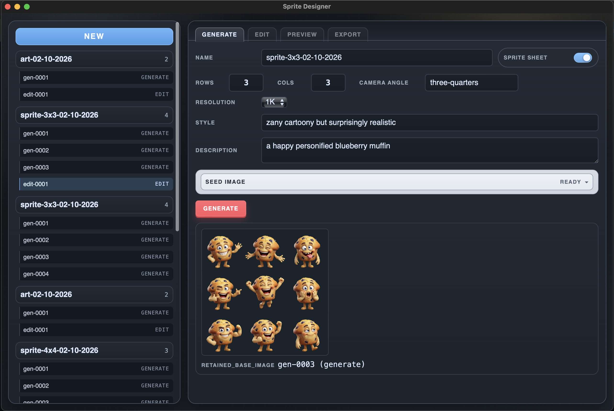

# Sprite Designer



Sprite Designer is a Tauri desktop app for generating and editing sprite images with OpenRouter models.

## Quick start

1. Install dependencies:
   ```bash
   pnpm install
   ```
2. Create `apps/desktop/.env` with:
   ```bash
   OPENROUTER_API_KEY=your_key_here
   ```
3. Launch the app:
   ```bash
   pnpm tauri dev
   ```

## OpenRouter env vars

Only `OPENROUTER_API_KEY` is required.

These are optional and have built-in defaults:
- `OPENROUTER_TITLE` defaults to `Sprite Designer`
- `OPENROUTER_MODEL` defaults to `google/gemini-3-pro-image-preview`
